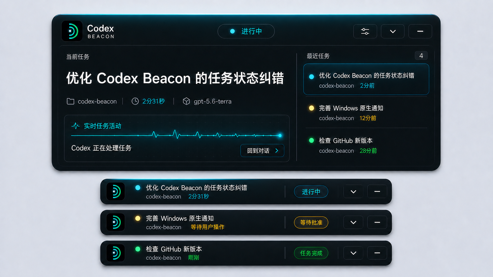

# Codex Beacon 设计说明

## 目标

Codex Beacon 是 Windows 上的 Codex 任务状态信标。界面不追求信息密度，而是让用户离开 Codex 窗口后，仍能在一眼内确认四件事：正在处理什么、属于哪个项目、已经运行多久、现在是否需要操作。

## 信息层级

折叠态是默认形态：

1. 标题前的状态点表达任务阶段。
2. 标题说明当前任务。
3. 第二行并列显示真实项目目录与耗时。
4. 右侧状态标签使用文字明确说明“进行中”“等待批准”“任务完成”等状态。

展开态补充最近任务、实时活动、模型、最后回复以及回到对应 Codex 对话的入口。展开面板点击空白区域或失去焦点时自动收起。

## 状态颜色

| 状态 | 颜色 | 用途 |
| --- | --- | --- |
| 进行中 | 青蓝 | 状态点、耗时、活动反馈 |
| 等待批准或回复 | 琥珀 | 需要用户介入的提醒 |
| 已完成 | 绿色 | 完成状态与短暂余辉 |
| 失败 | 红色 | 明确的失败反馈 |
| 失联 | 琥珀 | Hook 漏报或长时间无活动 |

同一状态只使用一套颜色，不让产品图标、任务状态点和文字产生互相冲突的信号。正式青绿图标只承担品牌识别，不再悬挂重复状态点。

## 视觉与交互

- 深色半透明表面配合单像素高光边缘，保持 Windows 悬浮层的轻量感。
- 灯光只用于状态点和边缘反馈，避免整段文字发光影响可读性。
- 状态标签字号为 12px；展开和缩小控件使用统一的 36×34px 视觉框。
- 展开与收起使用合成动画，不在动画期间频繁改变原生窗口尺寸。
- 尊重 `prefers-reduced-motion`，降低对动效敏感用户的干扰。

## 数据真实性

界面显示真实 Codex Hook 与本地 rollout 数据。项目名称直接取工作目录末级名称，不替换为产品名；任务状态会根据 rollout 终止事件和活动时间自动纠错，不使用 CPU 占用或虚构进度估算。
