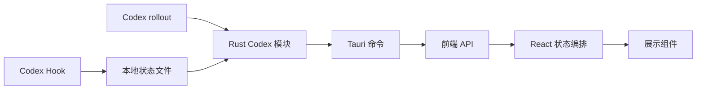

# 架构说明

Codex Beacon 采用轻量的“领域模块 + 平台模块 + 组合入口”结构。目标是让后续功能有明确归属，同时避免为初版引入状态库、依赖注入或插件系统。

## 数据流



- Hook 只负责接收 Codex 生命周期事件并原子写入本地状态。
- Rust 读取状态文件，并只读解析 rollout 来补充活动、计划和终止状态。
- 前端 API 封装所有 Tauri 命令名，组件不直接调用原生命令。
- `App.tsx` 只负责任务选择、轮询、界面模式和用户动作编排。

## 前端边界

```text
src/
├── codex/
│   ├── api.ts              # Codex Tauri 命令封装
│   ├── presentation.ts     # 文案、时间和项目名等纯展示转换
│   └── types.ts            # Codex 前端数据契约
├── desktop/
│   └── api.ts              # Windows 窗口与开机启动命令封装
├── components/
│   ├── CodexMark.tsx
│   ├── EmptyState.tsx
│   ├── SessionWorkspace.tsx
│   └── SettingsPanel.tsx
├── styles/
│   ├── base.css
│   ├── shell.css
│   ├── workspace.css
│   ├── empty-state.css
│   ├── settings.css
│   └── footer.css
└── App.tsx                 # 组合入口与页面状态
```

新增展示功能时优先修改对应组件和样式文件；新增 Codex 数据字段时同步修改 `types.ts`、Rust DTO 和 Hook 输出；新增桌面能力时通过 `desktop/api.ts` 接入。

## Rust 边界

```text
src-tauri/src/
├── codex.rs                # Codex 模块数据模型与对外入口
├── codex/
│   ├── status.rs           # 状态读取、归一化和打开对话
│   ├── rollout.rs          # rollout 定位、缓存和活动解析
│   ├── integration.rs      # Hook 安装、验证和 Codex 配置
│   ├── storage.rs          # Windows 路径、迁移和原子文件操作
│   └── tests.rs            # Codex 集成回归测试
├── desktop.rs              # 窗口、托盘、点击穿透和开机启动
├── lib.rs                  # Tauri 插件、setup 和命令注册
└── main.rs                 # 进程入口
```

`lib.rs` 和 `codex.rs` 是组合入口，不承载具体业务实现。新功能应进入拥有该职责的模块；只有出现第二个真实调用方时才提取新的共享抽象。

## 扩展约定

- 新增任务状态：先定义事件和状态契约，再更新 Rust 解析、前端类型与展示。
- 新增 Codex 交互：放入 `codex/`，不要混入 Windows 窗口代码。
- 新增 Windows 能力：放入 `desktop.rs` 和 `desktop/api.ts`。
- 新增界面区域：创建独立组件和对应样式文件，不把逻辑继续堆回 `App.tsx`。
- 保持本地优先：任务内容不上传，rollout 只读，Hook 写入必须可恢复。
- 保持测试贴近协议：Hook、状态迁移、终止事件、审批识别和命令参数变化都需要回归测试。
